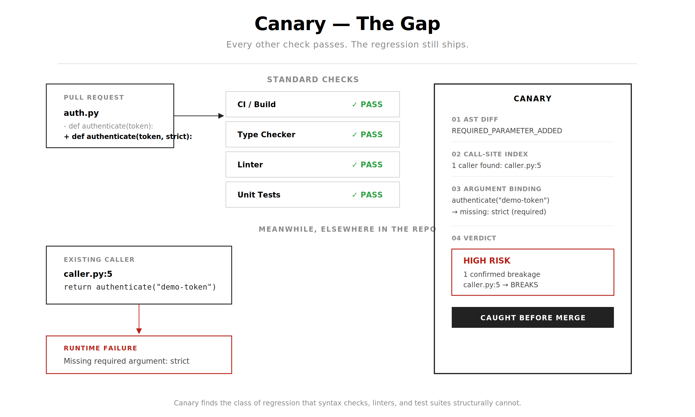
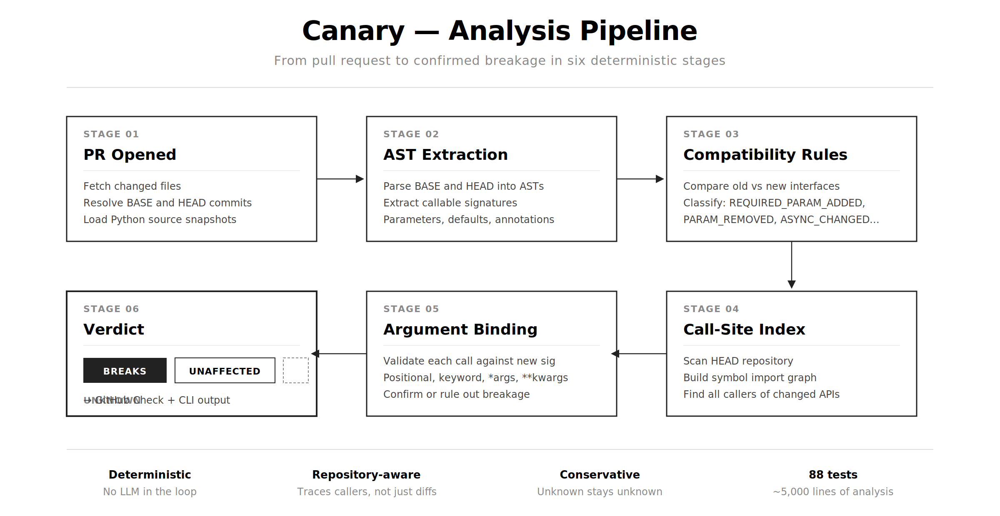
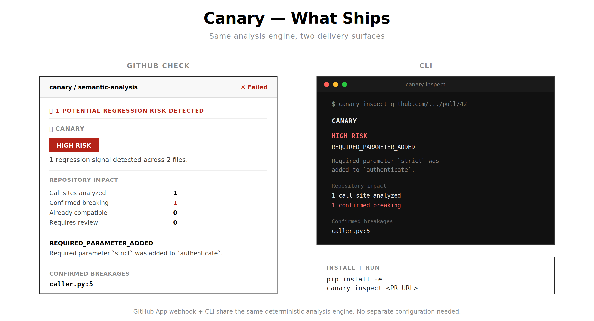
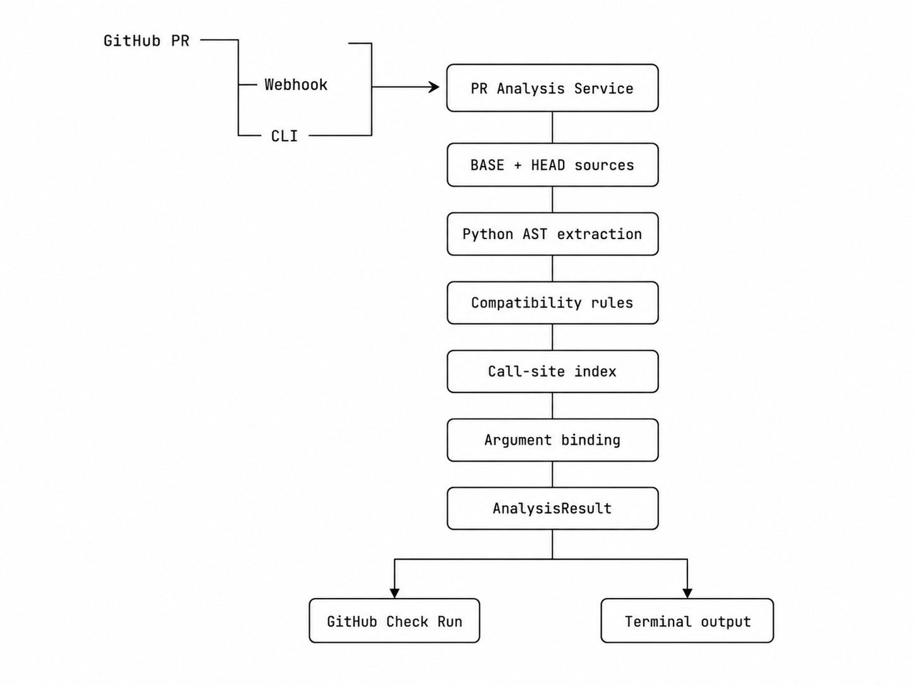

# Canary

### Trace breaking API changes to the callers they actually affect.

**Canary is a deterministic, repository-aware static analysis engine for Python pull requests.**  
It compares API contracts across BASE → HEAD, traces changed interfaces through repository call sites, statically re-binds existing calls against the new signatures, and surfaces confirmed incompatibilities before merge.


<p align="center">
  <strong>99.6 ms</strong> median analysis
  &nbsp; • &nbsp;
  <strong>76.7K LOC/s</strong> throughput
  &nbsp; • &nbsp;
  <strong>50/50</strong> deterministic runs
  &nbsp; • &nbsp;
  <strong>7/7</strong> semantic regression classes
</p>

<p align="center">
  
  
  
  
  <a href="https://github.com/cybr-wisp/canary/actions/workflows/ci.yml">
    
  </a>
  <a href="https://github.com/cybr-wisp/canary/releases">
    
  </a>
</p>


## The Problem

A pull request can pass CI, type checking, linting, and every unit test while still introducing an interface change that silently breaks downstream code. Standard tooling checks whether code is syntactically valid, not whether existing callers still satisfy the new contract.

## This Project

Canary is a deterministic GitHub App and CLI that detects Python API changes, traces them to every repository caller, and confirms whether existing call sites are still compatible, all before the PR merges. No LLM in the analysis loop. Same repo state, same PR, same findings, every time.

---

## The Gap

Every other check passes. The regression still ships.



---

## Analysis Pipeline

Six deterministic stages from pull request to confirmed breakage.



---

## What Ships

Same analysis engine, two delivery surfaces.



---

## What Canary Detects

Canary analyzes Python function and method interfaces across seven semantic compatibility rules.

| Finding | Example |
|---|---|
| `REQUIRED_PARAMETER_ADDED` | `def f(a)` → `def f(a, b)` |
| `PARAMETER_REMOVED` | `def f(a, b)` → `def f(a)` |
| `PARAMETER_REORDERED` | `def f(a, b)` → `def f(b, a)` |
| `PARAMETER_DEFAULT_REMOVED` | `def f(a=1)` → `def f(a)` |
| `RETURN_TYPE_CHANGED` | `def f() -> str` → `def f() -> int` |
| `ASYNC_BEHAVIOR_CHANGED` | `def f()` → `async def f()` |
| `PUBLIC_API_REMOVED` | `def f()` → *(deleted)* |

For each finding, Canary searches the repository for callers and classifies every call site:

| Status | Meaning |
|---|---|
| `BREAKS` | Static binding confirms incompatibility |
| `UNAFFECTED` | Call remains compatible with the new signature |
| `UNKNOWN` | Static analysis cannot safely determine |

---

## Argument-Aware Validation

Canary performs full static argument binding against changed signatures, accounting for positional arguments, keyword arguments, required and optional parameters, positional-only and keyword-only parameters, `*args`, `**kwargs`, duplicate bindings, excess positional arguments, unexpected keywords, and awaited vs non-awaited calls.

---

## GitHub Check

Canary runs automatically on PRs that are opened, updated, reopened, or marked ready for review. High-risk findings fail the check.

The check reports overall risk level, compatibility findings, files and functions analyzed, repository call sites, confirmed breakages, compatible calls, and calls requiring manual review. Inline annotations mark affected source lines.

---

## CLI

```bash
canary inspect https://github.com/owner/repo/pull/123
```

The CLI shares the same analysis engine as the GitHub App. No separate configuration.

---

## Architecture




---

## Quick Start

```bash
git clone https://github.com/cybr-wisp/canary.git
cd canary
python -m venv .venv
```

```powershell
# Windows
.\.venv\Scripts\Activate.ps1
```

```bash
# macOS / Linux
source .venv/bin/activate
```

```bash
pip install -e .
canary --help
```

### Run the webhook service

```bash
uvicorn app.main:app --reload
```

```
GET  /health
POST /webhook
```

### GitHub App setup

Create `.env` from `.env.example`:

```env
GITHUB_APP_ID=
GITHUB_PRIVATE_KEY_PATH=
GITHUB_WEBHOOK_SECRET=
```

The App needs pull request metadata, repository contents, and Checks API access. It receives `pull_request` webhook events.

---

## Tests

Canary includes **88 automated tests** across the security, webhook, review, and integration layers of the system.

```bash
pytest -q
```

The suite covers critical paths including:

* webhook HMAC signature verification
* rejection of malformed or unauthenticated requests
* GitHub event parsing and routing
* pull-request event handling
* review pipeline behavior
* API and service-layer logic
* error and failure-path handling
* integration behavior across webhook → review execution

The tests are concentrated around Canary's highest-risk boundaries: **untrusted external input, event-driven processing, and GitHub API interactions**.

```text
GitHub
   │
   ▼
Webhook Request
   │
   ├── Signature Verification ───── tested
   │
   ▼
Event Routing ───────────────────── tested
   │
   ▼
Pull Request Processing ─────────── tested
   │
   ▼
Review Pipeline ─────────────────── tested
   │
   ▼
GitHub API / Checks ─────────────── tested
```

With **88 automated tests**, Canary's test suite acts as both a local regression harness and a CI gate for changes to the review pipeline.

---

## Project Structure

```
canary/
├── app/
│   ├── analysis/           semantic analysis engine
│   │   ├── ast_analyzer.py        AST extraction
│   │   ├── compatibility.py       interface comparison
│   │   ├── call_validation.py     argument binding
│   │   ├── impact.py              blast-radius analysis
│   │   ├── repository_analyzer.py symbol + call-site index
│   │   ├── risk_rules.py          severity classification
│   │   ├── diff_parser.py         fallback diff analysis
│   │   └── analyzer.py            orchestration
│   ├── github/              GitHub App integration
│   ├── services/            PR analysis service
│   ├── terminal/            CLI presentation
│   ├── cli.py               Typer CLI
│   ├── main.py              FastAPI entrypoint
│   └── models.py            domain models
├── tests/
│   ├── unit/                13 test modules
│   └── integration/         webhook tests
├── .github/workflows/       CI + release
└── pyproject.toml
```

---

## Tech Stack

| Layer | Tools |
|---|---|
| Language | Python 3.11+ |
| Semantic analysis | Python `ast` module |
| API / webhook | FastAPI |
| GitHub integration | GitHub Apps, Checks API, REST API |
| CLI | Typer |
| Terminal UI | Rich |
| Configuration | Pydantic Settings |
| HTTP client | HTTPX |
| Testing | pytest, pytest-asyncio |
| CI/CD | GitHub Actions |

---

## Design Principles

**Deterministic.** No LLM. Findings are derived from repository structure, Python syntax, compatibility rules, and statically observable call behavior.

**Repository-aware.** A signature change alone is not the story. Canary traces how that interface is actually used across the codebase.

**Conservative.** When static analysis cannot reliably prove compatibility or incompatibility, the call site is classified as unknown rather than guessed.

**Explainable.** Every finding has a concrete reason, a source location, and a call site.

**PR-native.** Analysis appears where developers already review code: GitHub Checks, diff annotations, and the terminal.

---

## Limitations

Canary is a lightweight static analysis system. Current constraints include Python-only analysis, no runtime type inference, limited instance-method resolution, no dynamic import resolution, no monkey-patch modeling, and no reflection/dispatch tracing. Ambiguous `*args`/`**kwargs` calls may require manual review.

These are deliberate. When Canary cannot justify a conclusion, it surfaces uncertainty rather than manufacturing confidence.

---

## Roadmap

### Shipped (v2.0)
- [x] Python AST analysis
- [x] 7 semantic compatibility rules
- [x] Repository-wide symbol + call-site indexing
- [x] Argument-aware call validation
- [x] GitHub Check with inline annotations
- [x] CLI with terminal presentation
- [x] CI/CD pipeline
- [x] 88-test suite

### Future
- [ ] Additional language support
- [ ] Deeper Python type inference
- [ ] Instance-method resolution
- [ ] Interprocedural data-flow analysis
- [ ] Configurable repository policies
- [ ] Package-level compatibility analysis

---

## v1 → v2

v1 established the deterministic PR analysis pipeline: diff parsing, signature-level risk rules, GitHub Check.

v2 extends into repository-aware semantic analysis: AST extraction, compatibility rules, call-site discovery, argument binding, and confirmed breakages with source locations.

The key shift: Canary no longer stops at "this API changed." It continues to "these callers use it, and these calls no longer bind."

---

## License

See [`LICENSE`](LICENSE).